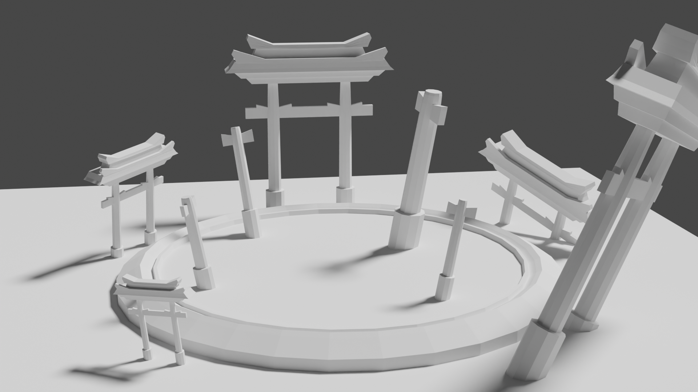
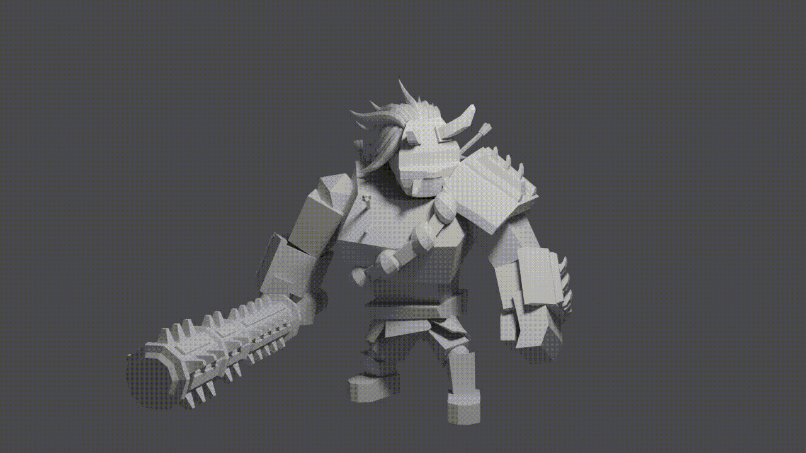

# GDD Juego de Proyectos III 

## Índice

1. [Descripción](#desc)
1. [Mecánicas](#mec)
    1. [Mecánicas del jugador](#mecjug)
    1. [Mecánicas de enemigos](#mecene)
    1. [Mecánicas de escenarios](#mecesc)
    1. [Mecánicas de interacción](#mecint)
1. [Dinámica](#dinam)
1. [Estética](#estet)
1. [Contenido](#cont)
    1. [Enemigos](#enemi)
    1. [Escenarios](#escena)
1. [Arquitectura](#arqui)
1. [Controles](#contro)

# Descripción 

“El Juego de Iván” es un videojuego 3D del género Beat 'em up/Bullet hell con perspectiva isométrica en el que controlas a un valiente enamorado. Para lograr su objetivo y ganarse la aprobación de su amada,  deberá bajar al infierno y derrotar a unos enemigos temibles y sedientos de sangre. ¿Serás capaz de salir vivo del inframundo y conquistar a su amante?

El juego se puede jugar en Windows y está destinado a jugadores mayores de 12 años que les guste el frenetismo y la agilidad. No apto para gente más pequeña debido a su violencia.

# Mecánicas 
## i. Mecánicas del jugador 

1.- <u>Movimiento</u>: El jugador se puede mover en 8 direcciones, siempre a la misma velocidad independientemente de la dirección en la que vaya. Cambiar de dirección, comenzar a moverse o frenar es instantáneo, es decir, no tiene aceleración.

2.- <u>Salud</u>: Se comienza la partida con una barra de vida completa, dividida en “X” fragmentos. Al recibir daño, se pierden “Y” fragmentos dependiendo del ataque de los enemigos.
Se puede recuperar ¼ de fragmento de vida por golpe atacando a un enemigo.

3.- <u>Esquivar</u>: El jugador cuenta con un “dash” que también es en 8 direcciones, durante el cual recorre una pequeña distancia y se hace invulnerable. Tiene un tiempo de espera reducido.

4.- <u>Ataque/s</u>: El jugador puede realizar un ataque rápido a meleé en la dirección en la que apunta el ratón. Tiene un tiempo de espera reducido.

## ii. Mecánicas de enemigos 

Cada nivel contendrá un jefe que luchará contra el jugador, con distintos ataques cronometrados y mecánicas que deberá aprovechar el protagonista para derrotarlo.

Todos los "bosses" van a compartir una serie de ataques generales independientemente de su dificultad o tipo.

<u>Embestidas</u>: El enemigo se impulsa hacia el jugador recorriendo una cierta distancia hasta pararse o colisionar con él. La dirección de este impulso se ve reflejada en el suelo para que sea esquivable.

<u>Proyectiles</u>: El enemigo lanza uno o varios proyectiles desde su posición hacia el jugador. Dichos proyectiles tardan X tiempo en llegar al jugador.

<u>Golpe sísmico</u>: El enemigo salta en su posición y al caer e impactar contra el suelo genera una onda la cuál se expande en todas las direcciones y que el jugador deberá esquivar usando su "dash" como única forma para no hacerse daño.

<u>Ataques Meleé</u>: Los enemigos cuentan con un arma a meleé (mazas, espadas, fuego... etc.) los cuales van a ejecutar cuando el jugador se encuentre cerca para intentar golpear al boss.

## iii. Mecánicas de escenarios 

Al igual que los enemigos, los escenarios también comparten una serie de mecánicas comunes a todos.

<u>Caída</u>: De todos los escenarios independientemente de su tamaño, el jugador se puede caer al vacío, perdiendo así toda la vida.

<u>Obstáculos</u>: Todos los escenarios cuentan con obstáculos distribuidos los cuáles pueden ser muy útiles para las coberturas del jugador. Todos son destruibles para evitar el descanso del jugador y posibles glitchs.

<u>Fuego</u>: Debido a que los escenarios se ecuentran en el infierno, hay fuego que puede aparecer desde el suelo en cualquier momento y en cualquier punto del escenario con un efecto en el suelo a modo de aviso previo.

## iv. Mecánicas de interacción 

(Por especificar)

# Dinámica 

La dinámica del juego dependerá esencialmente del boss contra el que se esté luchando en cada momento pero todos comparten una serie de comportamientos. 

En general, los “bosses” van a disparar proyectiles, en muchas direcciones, los cuales van a obligar al jugador a usar su “dash” para esquivarlos.

A su vez, cuando los “bosses” terminen de realizar sus ataques, para acercarse a ellos y aprovechar el tiempo hasta que vuelvan a volver a atacar, el jugador puede usar el dash y  posteriormente atacar con su ataque a melée.

Además, puede que algunos escenarios incluyan obstáculos, destruibles por los proyectiles de los enemigos, los cuales puede usar el jugador para cubrirse y esperar a un mejor momento para atacar.

Por último, el hecho de que se cure, afecta a la dinámica de tal forma que, dependiendo de cuánta vida tenga el jugador en un determinado momento, deberá decidir si necesita arriesgarse y acercarse al “boss” para pegarle o si considera que no necesita mucha más vida para vencerlo.

# Estética 

El juego tiene una estética low poly, ambientada en diferentes escenarios del infierno.
El primero se ambienta en un escenario con temática japonesa.
El segundo en una cueva infernal y el tercero en un templo derruido con estética Griega.

  
   

# Contenido 

## i. Enemigos 

El juego cuenta con 3 enemigos distinguidos:

* Yekum, el Demonio de las Profundidades

Yekum es un demonio robusto con partes del cuerpo desgarradas las cuales muestran partes de sus huesos, principalmente su columna vertebral, con grandes cuernos y dientes afilados. Será el segundo jefe del juego y poseerá mecánicas parecidas al anterior, con pequeñas variaciones en sus ataques.
Este jefe servirá como introducción del combate para el jugador al solo tener dos ataques sencillos y una cantidad de vida menor a la del resto de jefes, preparándolo para los combates contra los futuros jefes que se vaya encontrando el jugador.

Ataques:\
-<u>Hyouhaku</u>: Yekum cargará su boca de fuego y lo escupirá en forma cónica hacia la dirección del jugador, éste no podrá esquivar el fuego y deberá hacer uso de los pilares del mapa para protegerse.\
-<u>Shiko Kuzimo</u>: Yekum tiene un área muy pequeña a su alrededor que en caso de entrar el jugador, éste será agarrado por Yekum y le producirá una cantidad moderada de daño de forma continuada durante un periodo de tiempo

* Otoroshi, el Oni Infernal

Otoroshi es el segundo jefe del juego y posee mecánicas más complicadas que el primero pero conservando aún la simpleza. Es un demonio japonés, grande y corpulento, que porta una gran maza la cuál usará únicamente a la hora de pelear contra un oponente digno, es decir, una vez la vida de Otoroshi alcanza la mitad de su vida máxima sacará su arma.
Sus golpes se basarán en ataques lentos pero potentes que obligarán al jugador a esquivar y contraatacar una vez realizado el ataque.

-Ataques:\
-<u>Panchi Ken</u>: Consiste en un ataque simple usando un puño,no requiere de ninguna carga para poder realizarse, y se realiza de forma regular en el tiempo.\
-<u>Nokku Mesu</u> : Cuando el enemigo está a la mitad de su vida, realiza una carga de X segundos para preparar el ataque, posteriormente saca una maza con la que golpeara al suelo , y trás el golpe, el impacto viajará por el suelo dañando al jugador si este se encuentra en el área del impacto.\
-<u>Noboru</u>: Consiste en una bola de llamas que disparará Otoroshi de su brazo derecho, dicha bola de llamas será inesquivable y el jugador deberá protegerse con los pilares del mapa para evitar sufrir daños.\
-<u>Mo Kogeki</u>: Otoroshi realiza una carga de X segundos para preparar una embestida, durante esta carga aparecerá una línea que marcará la zona y dirección de la embestida, y pasado dicho tiempo se moverá rápidamente en esa dirección.

  

* Ivasan, el caballero demoníaco

Un demonio elegante con traje y dos cuernos que tapan su oscuro rostro. Será el último jefe del juego y poseerá 2 fases además de muchos ataques diferentes al resto de jefes.

Fase 1:

-<u>Panchi</u>: Ataque básico que inflige daño al jugador si se encuentra muy cerca, si afecta al jugador dos veces el tercer ataque será más poderoso.\
-<u>Jūryokujō</u>: Al empezar la batalla el jefe invoca en el centro del mapa un centro de gravedad que atrae al jugador y en caso de que se acerque mucho provocará lentitud.\
-<u>Chimei-tekina Hinotama</u>: En un momento dado Ivasan se elevará y lanzará bolas de fuego inesquivables, por lo que el jugador deberá protegerse usando las columnas del mapa. En caso de no esquivarlas le provocará un daño inmenso.\
-<u>Bakuhatsu-sei inseki</u>: Ivasan hará que cada cierto tiempo caigan meteoritos por el mapa cerca de la zona por la que se está moviendo el jugador.

Cambio de Fase:

-<u>Shinka no kami</u>: Ivasan se elevará y provocará la elevación del mapa, además, comenzarán a caer meteoritos cada vez más grandes que terminan dividiendo la zona del mapa en dos plataformas.

Fase 2:

-<u>Panchi 2.0</u>: Igual que el ataque a corta distancia de la primera fase pero con más fuerza y velocidad.\
-<u>Kazan dasshu</u>: Ivasan hará una embestida rápida que provocará daño y quemará la zona por la que pase.\
-<u>Jūryoku shifuto</u>: El jefe puede cambiar la gravedad dentro de la zona del mapa haciendo que los saltos tengan que hacerse más cerca del borde de las plataformas o más lejos.

## ii. Escenarios 

El juego cuenta con 3 escenarios diferenciados (un para cada "boss"):

* Escenario de Yekum

El mapa para este jefe está ambientado en una cueva, que sería la casa del personaje. Los límites del mapa no son uniformes y vendrán dados por la forma de la cueva. Al estar en el infierno, dentro del mapa aparecerán de vez en cuando puntos aleatorios con zonas de fuego que le quitarán vida al jugador si se queda en ellas. Dentro del mapa, además del fuego, saldrán columnas de lava de duración temporal que harán que harán daño al jugador al acercarse y harán que el ataque Hyouhaku del jefe haga más daño y dure más.

* Escenario de Otoroshi

El mapa para este jefe está ambientado en la plaza en ruinas de un pueblo japonés. Al estar en el infierno, dentro del mapa aparecerán de vez en cuando puntos aleatorios con zonas de fuego que le quitarán vida al jugador si se queda en ellas. Dentro del mapa, además del fuego, habrá columnas con las que evitar los ataques de Otoroshi. La zona de combate estará delimitada por soldados del pueblo, que te empujaran al combate si te acercas mucho a ellos, además de quitarte una pequeña cantidad de vida. Estos serán estéticamente parecidos al jefe pero con una apariencia menos imponente.

* Escenario de Ivasan

El mapa para este jefe es un templo derruido Griego/Romano, hay fuego por el mapa al igual que en el resto de mapas. Durante la primera fase hay columnas por el mapa que hay que usar para evitar el ataque a distancia del jefe y también hay un centro de gravedad en el medio del mapa, que atrae al jugador si está muy cerca. Después en la segunda fase el mapa cambia y pasan a ser plataformas que irán apareciendo y desapareciendo ya que el mapa pasará a estar levitando.

# Arquitectura 

# Controles 

